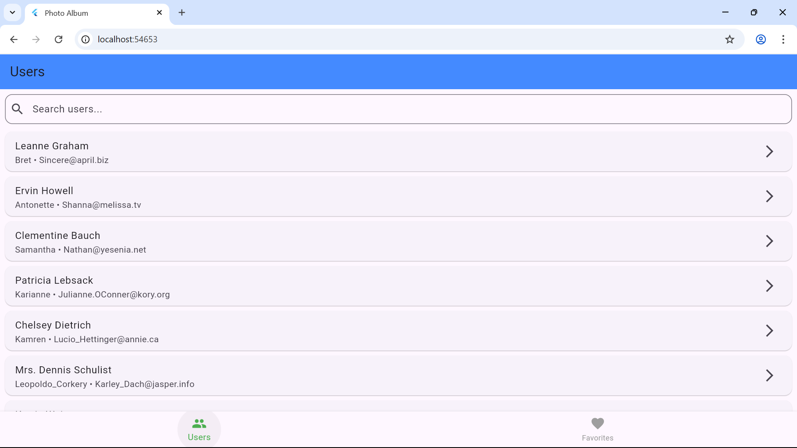
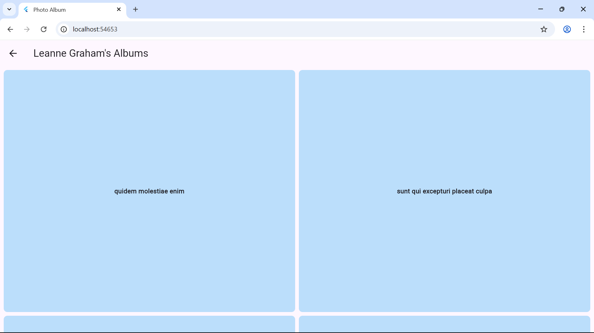
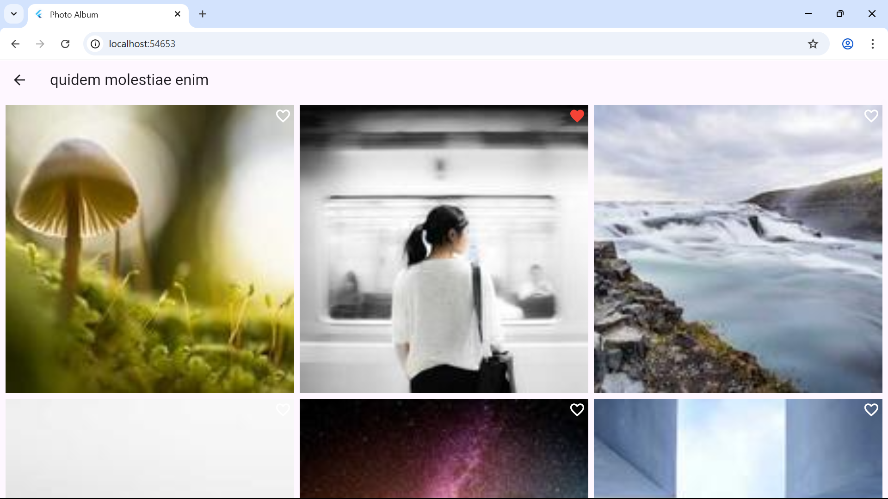
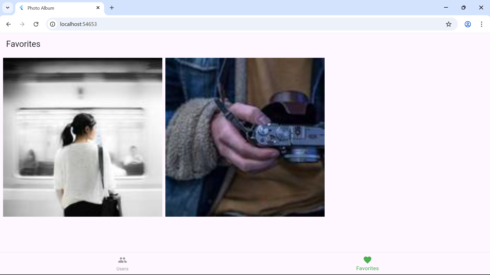

# 📸 Photo Album App

A simple **Flutter photo album application** where users can browse photo collections, view details, and mark photos as **favorites**.  
Built with Flutter and `shared_preferences` for local storage.

---

## 📸 Screenshots

| Home                          | Albums                            | Photos                            | Favorites                               |
| ----------------------------- | --------------------------------- | --------------------------------- | --------------------------------------- |
|  |  |  |  |

---

## 📸 Video

| Photo_Album_Video |
[Watch the demo](screenshots/photo_album_video.mp4)

---

## ✨ Features

- 👥 User list & albums
- 🖼️ Photo grid & detail view
- ⭐ Save favorite photos (stored locally)
- 🔍 Interactive zoom with `InteractiveViewer`
- 🎨 Clean and simple Material design

---

## 🛠️ Tech Stack

- **Flutter** (Dart)
- **SharedPreferences** (local storage)

---

## 🚀 Getting Started

### 1. Clone the repository

```bash
git clone https://github.com/Na-Tec/photo_album_app.git
cd photo_album_app
```

### 2. Install dependencies

```bash
flutter pub get
```

### 3. Run the app

```bash
flutter run
```

---

## 📂 Project Structure

```
lib/
 ├── models/        # Data models (User, Album, Photo)
 ├── services/      # Local storage & API services
 ├── screens/       # UI screens (Users, Albums, Photos, Favorites, Viewer)
 ├── widgets/       # Reusable widgets
 └── main.dart      # App entry point
```
